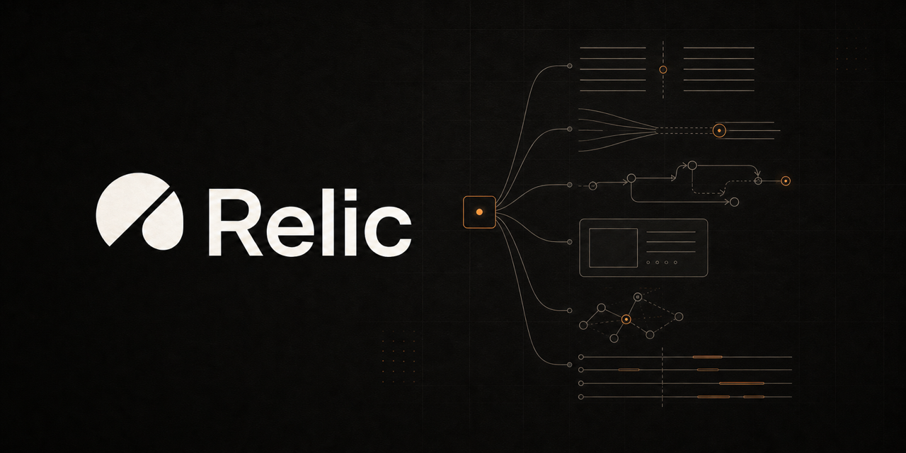
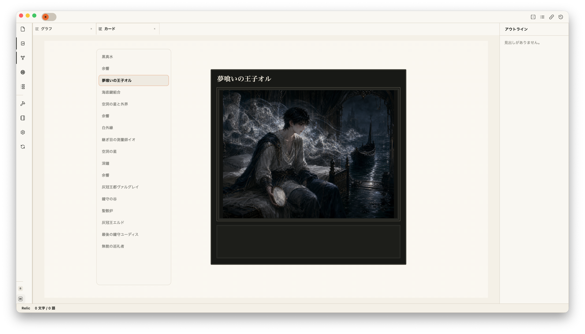
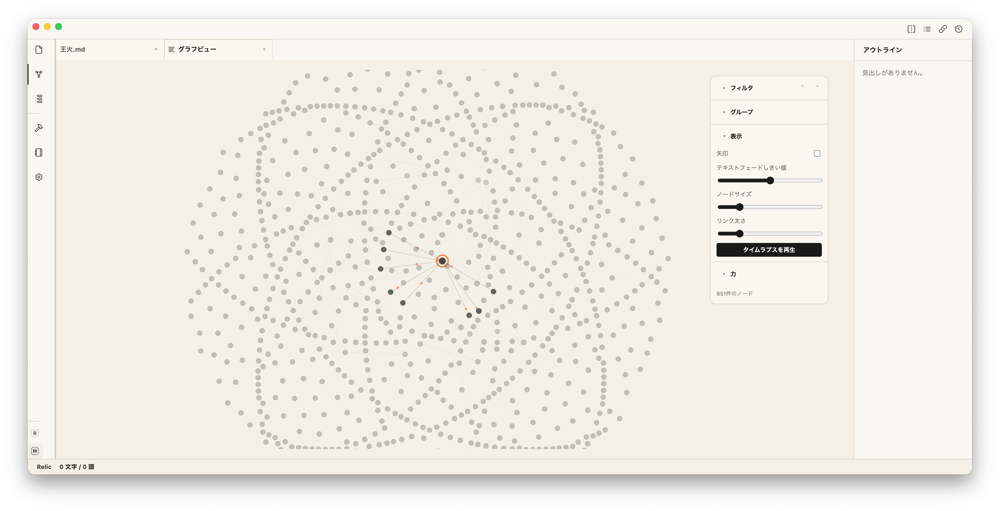
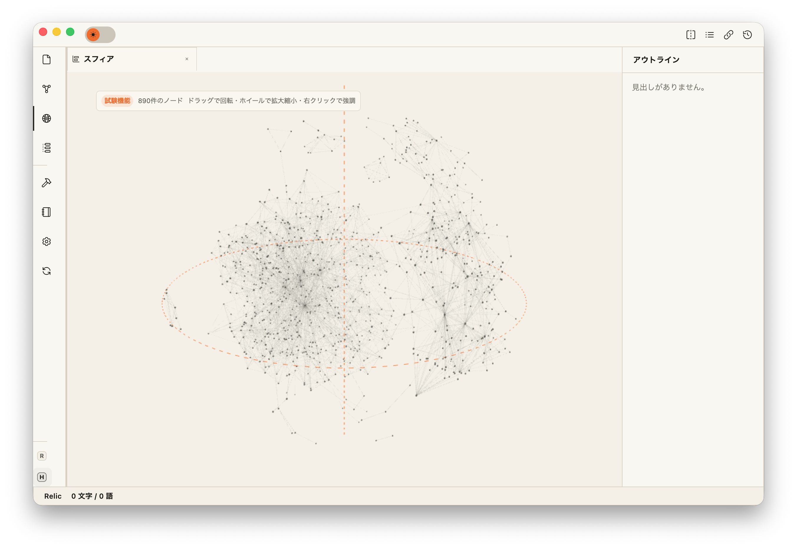

# Relic

[日本語はこちら](#日本語)



Relic is a local app for keeping information as plain Markdown files while extending how that information can be edited, viewed, searched, visualized, and exported.

Relic treats Markdown text as the source of truth: body text, headings, lists, tables, links, tags, front matter, and code blocks remain readable and portable as Markdown. Mermaid and D2 diagrams are also handled as Markdown code blocks, not as Relic-only diagram data.

Relic is open source software licensed under the GNU Affero General Public License v3.0 or later (AGPL-3.0-or-later).

> Status: In development

---

## Who Relic Is For

- People who want to keep long-lived knowledge in Markdown files.
- People who want to use links, tags, front matter, and code blocks as the basis for search, reading, visualization, and export.
- People organizing worldbuilding notes, research notes, learning notes, personal wikis, or project documentation locally.
- People who want to manage local folders or cloud-synced folders without locking their notes into a proprietary database.

---

## Main Features

### Markdown Workspace

- File view for reading and editing Markdown.
- Markdown editor with live preview, source mode, and optional typewriter mode.
- Page previews for internal links and collapsible Markdown headings.
- Automatic saving with recovery versions for restoring earlier content.
- Local workspace management.
- File and folder creation, rename, move, duplicate, delete, and pinning.
- Tabs, split view, and a right-side panel.
- Light, dark, and system-following themes.


### Attachments and Embedded Content

- Drag supported images into Markdown to copy them into the workspace and insert standard Markdown image syntax.
- Open workspace images and PDF attachments in dedicated viewing tabs.
- Embed another workspace Markdown file with `![[file]]` while keeping the source file as Markdown.

### Card View

- Optional Card view presents Markdown files with a `card` front matter image as visual cards.
- Selecting an item in the list previews its card; selecting the large card opens the source Markdown file.



### Linking, Search, and Structure

- Internal links using `[[...]]` and relative Markdown links.
- Backlinks, outgoing links, and unlinked references.
- Optional Graph view for Markdown, tags, attachments, and unresolved links.
- Optional experimental Sphere view for exploring the workspace graph in 3D.
- Outline view.
- Quick switcher.
- Command palette.
- Full-text search, filename search, tag search, and front matter search.





### Front Matter and Tags

- YAML front matter editing support.
- Optional front matter settings for fixed properties (`aliases`, `card`, `category`, `tags`, `chronicle`) and custom property input.
- Tags from front matter `tags:`.

### Diagrams and Export

- Mermaid and D2 diagram rendering from Markdown code blocks.
- PDF export from Markdown preview.
- Copy and save diagram SVG output.

### Chronicle View

- Optional Chronicle view that places Markdown files on a timeline from `chronicle` front matter values.


### File Processing Tools

- Optional file processing tools are available from feature toggles.
- Merge files.
- Generate title lists.
- Generate tables of contents.
- Generate tag indexes.

Front matter settings, Card view, Graph view, Sphere view, Chronicle view, and file processing tools are implemented but hidden by default. They can be enabled from Settings feature toggles.

---

## Platforms

- macOS
- Windows

Relic is an Electron app. OS-specific handling is kept to the places where it is necessary, and normal file operations are treated as operations on each OS's local folders.

---

## Tech Stack

- TypeScript
- Electron
- React
- CodeMirror 6
- Zustand
- Vitest
- Electron Forge
- pnpm

See [docs/engineering/stack.md](docs/engineering/stack.md) for details.

---

## Repository Structure

- `app/`: Electron / React app.
- `docs/`: Specifications, design, and development documents.
- `docs/project/`: Relic's purpose, target users, and terminology.
- `docs/features/`: Feature specifications.
- `docs/design/`: Screens, navigation, and design system documents.
- `docs/engineering/`: Architecture, data model, and technical decisions.
- `docs/development.md`: Development rules, coding rules, testing policy, versioning, and release operations.
- `skills/`: Distributable Codex Skills for people using Relic. These are separate from repository-development agent instructions.
- `scripts/`: Helper scripts for running and building the app.
- `AGENTS.md`: Shared rules for AI agents working on this repository.
- `CONTRIBUTING.md`: Contribution guidelines.
- `LICENSE`: AGPL-3.0-or-later license text.
- `SECURITY.md`: Policy for secrets, credentials, and vulnerability reporting.
- `README.md`: Public project overview.

---

## Development

Run app commands from `app/`. The supported development Node.js range is defined by `app/package.json` `engines.node`. pnpm is pinned by `packageManager` and enabled through Corepack.

```sh
cd app
corepack enable
pnpm install
pnpm start
```

OS-specific start aliases:

```sh
pnpm start:mac
pnpm start:win
```

`start:mac` and `start:win` are aliases for the same Electron development start command. Use the alias that matches the OS you are running on.

If you prefer not to use terminal commands directly, helper scripts are available in `scripts/`.

- macOS: `scripts/Relicを起動.command`
- Windows: `scripts/Relicを起動.bat`

---

## Verification

Run type checking and tests together:

```sh
cd app
pnpm verify
```

Run the full set of locally reproducible checks, including coverage reporting, architecture, documentation, workflow, and Skill structure checks:

```sh
cd app
pnpm verify:full
```

Run the reproducible part of Code CI, adding dependency notices, SBOM, and the Renderer production boundary check:

```sh
pnpm verify:ci
```

Run checks individually:

```sh
pnpm typecheck
pnpm test
pnpm docs:index:check
git -C .. diff --check
```

Print the current Git-tracked file tree without changing documentation:

```sh
pnpm docs:tree
```

OS-specific test aliases:

```sh
pnpm test:mac
pnpm test:win
```

Pull Requests, pushes to `main`, and manual Code CI runs execute `verify:ci`. Pull Requests additionally validate version policy against their base and head commits. The packaged app under `app/out/` is checked only when distribution build verification is explicitly requested. Before creating a release tag, the manual Pre-release Verification workflow can run the existing safe builds on macOS and Windows without creating a tag, Release, push, or repository change.

---

## macOS Build

```sh
cd app
pnpm build:mac:safe
```

You can also run `scripts/Relicをビルド.command`, which executes `build:mac:safe`.

`build:mac:safe` runs:

1. Removes the previous `app/out/darwin` output.
2. Runs Electron Forge `make` for macOS.
3. Verifies the generated package and its contents.

Verification checks:

- Required: `out/darwin/Relic-darwin-*/Relic.app/Contents/MacOS/Relic`
- Required: `out/darwin/Relic-darwin-*/Relic.app/Contents/Resources/app.asar`
- Forbidden: `Setup*.exe` / `Update.exe` / `*.nupkg` / `RELEASES`

---

## Windows Build

The Windows build is distributed without an installer. After extracting the ZIP, run `Relic.exe` directly.

```sh
cd app
pnpm build:win:safe
```

You can also run `scripts/Relicをビルド.bat`, which executes `build:win:safe`.

`build:win:safe` runs:

1. Removes the previous `app/out/win32` output.
2. Runs Electron Forge `package` for 64-bit Windows.
3. Verifies the generated package and its contents.

Verification checks:

- Required: `out/win32/Relic-win32-x64/Relic.exe`
- Required: `out/win32/Relic-win32-x64/resources/app.asar`
- Forbidden: `Setup*.exe` / `Update.exe` / `*.nupkg` / `RELEASES`

For distribution, provide the `out/win32/Relic-win32-x64/` folder as-is or zip it.

---

## Documentation

- Documentation index and task-based routing: [docs/INDEX.md](docs/INDEX.md)
- Project overview: [docs/project/overview.md](docs/project/overview.md)
- Glossary: [docs/project/terms.md](docs/project/terms.md)
- Feature specifications: [docs/features](docs/features)
- Design documents: [docs/design](docs/design)
- Engineering documents: [docs/engineering](docs/engineering)
- Tech stack: [docs/engineering/stack.md](docs/engineering/stack.md)
- Development rules, coding rules, testing policy, versioning, and release operations: [docs/development.md](docs/development.md)

Current specifications and design decisions are documented in the documents above.

---

## Local Data and Privacy

Relic treats Markdown files in the local folder selected by the user as the source of truth.
Markdown content remains in that folder without being converted into a Relic-specific format.

Application settings are stored in the operating system's per-application data location.
Registered workspace names, absolute local paths, and interface settings are stored so Relic can restore workspaces.

Relic currently performs no automatic updates, external synchronization, external log transmission, or cloud storage.
Development commands that send information to external services, such as dependency audits, are used only when explicitly run under the development rules.

---

## Contributing

Contributions to Relic are welcome. Before opening a pull request, please read [CONTRIBUTING.md](CONTRIBUTING.md).

Unless otherwise agreed, submitted code and documentation are treated as AGPL-3.0-or-later, the same license as Relic itself.

---

## License

Relic is licensed under the GNU Affero General Public License v3.0 or later (AGPL-3.0-or-later). See [LICENSE](LICENSE) for the full license text.

Relic uses AGPL-3.0-or-later to allow forks and commercial use while keeping corresponding source code available to users of modified versions, including versions provided over a network.

---

## 日本語


Relicは、Markdownに書ける情報をMarkdownファイルのまま保ち、その情報をもとに編集・閲覧・検索・可視化・出力を拡張するローカルアプリです。

本文、見出し、リスト、表、リンク、タグ、フロントマター、コードブロックなど、Markdown内にテキストとして書ける情報を正本として扱います。MermaidやD2の図表も、Relic独自の図データではなく、Markdownコードブロックとして書ける情報だから扱います。

Relicはオープンソースソフトウェアです。ライセンスは GNU Affero General Public License v3.0 or later（AGPL-3.0-or-later）です。

> ステータス: 開発中

---

## 対象ユーザー

- Markdownに書いた情報を、Markdownファイルのまま長く残したい人
- Markdown内のリンク、タグ、フロントマター、コードブロックなどをもとに、検索・閲覧・可視化・出力を広げたい人
- 創作設定、研究ノート、学習メモ、個人Wiki、プロジェクト資料などをローカルに整理したい人
- ローカルフォルダやクラウド同期フォルダを、自分で管理できる形のまま使いたい人

---

## 現在の主な機能

### Markdownワークスペース

- Markdownを表示・編集するファイルビュー
- ライブプレビュー、ソースモード、任意のタイプライターモードを備えたMarkdownエディタ
- 内部リンクのページプレビューとMarkdown見出しの折りたたみ
- 以前の本文を読み戻せる復元版を伴う自動保存
- ローカルワークスペース管理
- ファイル / フォルダの作成、リネーム、移動、複製、削除、ピン留め
- タブ、左右分割表示、右パネル
- ライト / ダーク / システム追従テーマ


### 添付ファイルと埋め込み

- 対応画像をMarkdownへドラッグし、ワークスペースへのコピーと標準Markdown画像記法の挿入ができます
- ワークスペース内の画像とPDF添付ファイルを専用の閲覧タブで表示できます
- 元ファイルをMarkdownのまま保ち、`![[ファイル名]]` で別のMarkdownファイルを埋め込めます

### カードビュー

- フロントマターの `card` で画像を指定したMarkdownファイルを、任意で有効化できるカードビューに表示します
- 一覧ではカードを切り替えて確認でき、大きなカードを選択すると元のMarkdownファイルを開きます


### リンク・検索・構造表示

- 内部リンク `[[...]]` とMarkdown相対リンク
- バックリンク、アウトゴーイングリンク、未リンク参照
- Markdown、タグ、添付画像、未解決リンクの関係を表示する、任意で有効化できるグラフビュー
- ワークスペースグラフを3次元で見渡す、任意で有効化できる試験的なスフィアビュー
- アウトライン表示
- クイックスイッチャー
- コマンドパレット
- 全文検索、ファイル名検索、タグ検索、フロントマター検索


### フロントマターとタグ

- フロントマター（YAML）編集補助
- 任意で有効化できるフロントマター設定（`aliases`、`card`、`category`、`tags`、`chronicle` の固定プロパティ確認・カスタムプロパティ入力能力）
- フロントマター `tags:` によるタグ扱い

### 図表と出力

- MarkdownコードブロックのMermaid / D2図表表示
- MarkdownプレビューのPDF保存
- 図表SVGのコピー / 保存

### クロニクルビュー

- `chronicle` フロントマター値からMarkdownファイルを時間軸上の年表へ配置する、任意で有効化できるクロニクルビュー


### ファイル加工ツール

- ファイル加工ツールは機能トグルで任意に有効化できます
- ファイルのマージ
- タイトル一覧の生成
- 目次生成
- タグ別索引生成

フロントマター設定、カードビュー、グラフビュー、スフィアビュー、クロニクルビュー、ファイル加工ツールは実装済みですが、初期状態では非表示です。設定の機能トグルから有効化できます。

---

## プラットフォーム

- macOS
- Windows

RelicはElectronアプリです。OS固有処理は必要な箇所だけに限定し、通常のファイル操作は各OSのローカルフォルダとして扱います。

---

## 技術スタック

- TypeScript
- Electron
- React
- CodeMirror 6
- Zustand
- Vitest
- Electron Forge
- pnpm

詳細は [docs/engineering/stack.md](docs/engineering/stack.md) を参照してください。

---

## リポジトリ構成

- `app/`: Electron / React アプリ本体
- `docs/`: 仕様・設計・開発文書
- `docs/project/`: Relicの目的、対象ユーザー、用語
- `docs/features/`: 機能仕様
- `docs/design/`: 画面構成、遷移、デザインシステム
- `docs/engineering/`: アーキテクチャ、データモデル、技術選定
- `docs/development.md`: 開発ルール、コーディング規約、テスト方針、バージョン管理、リリース運用
- `skills/`: Relic利用者へ配布するCodex Skill。リポジトリ開発エージェント向けの指示とは分離する
- `scripts/`: 起動・ビルドなどの補助スクリプト
- `AGENTS.md`: AIエージェント向けの共通ルール
- `CONTRIBUTING.md`: コントリビューション方針
- `LICENSE`: AGPL-3.0-or-laterのライセンス本文
- `SECURITY.md`: 秘密情報と認証情報の扱いに関する方針
- `README.md`: 対外的なプロジェクト説明

---

## 開発

アプリ本体のコマンドは `app/` で実行します。開発用Node.jsの対応範囲は `app/package.json` の `engines.node`、pnpmの版は `packageManager` を正本とし、Corepackで有効化します。

```sh
cd app
corepack enable
pnpm install
pnpm start
```

OS別の起動エイリアス:

```sh
pnpm start:mac
pnpm start:win
```

`start:mac` / `start:win` は同じElectron開発起動をOS別名で呼ぶためのエイリアスです。実行するOS上で使います。

ターミナル操作を避けたい場合は、`scripts/` 配下の補助スクリプトで開発版を起動できます。

- macOS: `scripts/Relicを起動.command`
- Windows: `scripts/Relicを起動.bat`

---

## 検証

型チェックとテストをまとめて実行します。

```sh
cd app
pnpm verify
```

カバレッジ測定、アーキテクチャ、文書、workflow、Skill構造まで、ローカルで再現可能な包括確認を行う場合:

```sh
cd app
pnpm verify:full
```

依存通知、SBOM、Rendererのproduction buildと初期読込境界の確認も加え、Code CIの再現可能部分を実行する場合:

```sh
pnpm verify:ci
```

個別に実行する場合:

```sh
pnpm typecheck
pnpm test
pnpm docs:index:check
git -C .. diff --check
```

文書を変更せず、Gitで管理している現在のファイルツリーを表示する場合:

```sh
pnpm docs:tree
```

OS別のテストエイリアス:

```sh
pnpm test:mac
pnpm test:win
```

Pull Request、`main`へのpush、手動のCode CIは `verify:ci` を実行します。Pull Requestではbase/head間のバージョン規則も追加確認します。`app/out/` 配下のパッケージ版アプリは、配布ビルド確認を明示した場合だけ確認対象にします。Releaseタグ作成前は手動のPre-release Verification workflowで、タグ、Release、push、リポジトリ変更を行わずにmacOSとWindowsの既存safe buildを実行できます。

---

## macOSビルド

```sh
cd app
pnpm build:mac:safe
```

補助スクリプトを使う場合は `scripts/Relicをビルド.command` を実行します。このスクリプトも `build:mac:safe` を実行します。

`build:mac:safe` は以下を順に実行します。

1. 前回の `app/out/darwin` を削除
2. Electron Forgeの `make` をmacOS向けに実行
3. 生成したパッケージと内容を検証

検証内容:

- 必須: `out/darwin/Relic-darwin-*/Relic.app/Contents/MacOS/Relic`
- 必須: `out/darwin/Relic-darwin-*/Relic.app/Contents/Resources/app.asar`
- 禁止: `Setup*.exe` / `Update.exe` / `*.nupkg` / `RELEASES`

---

## Windowsビルド

Windows版はインストーラーを使わず、ZIP展開後に `Relic.exe` を直接起動する運用です。

```sh
cd app
pnpm build:win:safe
```

補助スクリプトを使う場合は `scripts/Relicをビルド.bat` を実行します。このスクリプトも `build:win:safe` を実行します。

`build:win:safe` は以下を順に実行します。

1. 前回の `app/out/win32` を削除
2. Electron Forgeの `package` を64-bit Windows向けに実行
3. 生成したパッケージと内容を検証

検証内容:

- 必須: `out/win32/Relic-win32-x64/Relic.exe`
- 必須: `out/win32/Relic-win32-x64/resources/app.asar`
- 禁止: `Setup*.exe` / `Update.exe` / `*.nupkg` / `RELEASES`

配布する場合は、`out/win32/Relic-win32-x64/` フォルダをそのまま配布するかZIP化します。

---

## ドキュメント

- 文書索引・作業別の参照先: [docs/INDEX.md](docs/INDEX.md)
- プロジェクト概要: [docs/project/overview.md](docs/project/overview.md)
- 用語集: [docs/project/terms.md](docs/project/terms.md)
- 機能仕様: [docs/features](docs/features)
- デザイン文書: [docs/design](docs/design)
- エンジニアリング文書: [docs/engineering](docs/engineering)
- 技術スタック: [docs/engineering/stack.md](docs/engineering/stack.md)
- 開発ルール・コーディング規約・テスト方針・バージョン管理・リリース運用: [docs/development.md](docs/development.md)

現行の仕様・設計判断は上記の文書を参照します。

---

## ローカルデータとプライバシー

Relicは、ユーザーが選んだローカルフォルダ内のMarkdownファイルを正本として扱います。
Markdown本文はRelic専用の形式へ変換せず、ユーザーが選んだフォルダに残ります。

アプリ設定は、OSがアプリごとに用意する設定保存場所に保存します。
登録したワークスペースの名前、ローカル絶対パス、画面設定などは、ワークスペースを復元するために保存します。

現時点では、自動更新、外部同期、外部ログ送信、クラウド保存は行いません。
依存関係監査など、外部サービスへ情報を送る開発用コマンドは、開発ルールに従って明示的に実行する場合だけ使います。

---

## コントリビューション

Relicへのコントリビューションを歓迎します。Pull Requestを送る前に [CONTRIBUTING.md](CONTRIBUTING.md) を確認してください。

提出されたコードやドキュメントは、特別な合意がない限り、Relic本体と同じAGPL-3.0-or-laterとして取り扱います。

---

## ライセンス

Relicは GNU Affero General Public License v3.0 or later（AGPL-3.0-or-later）で公開されています。全文は [LICENSE](LICENSE) を参照してください。

AGPL-3.0-or-laterを採用する理由は、フォークや商用利用を許可しながら、改変版やネットワーク経由で提供される派生版についても、利用者が対応するソースコードへアクセスできる状態を保つためです。
