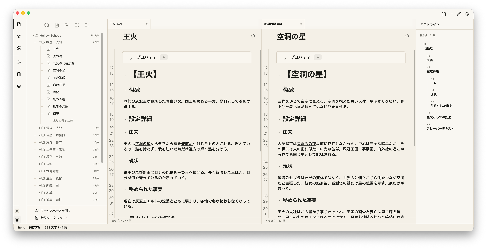
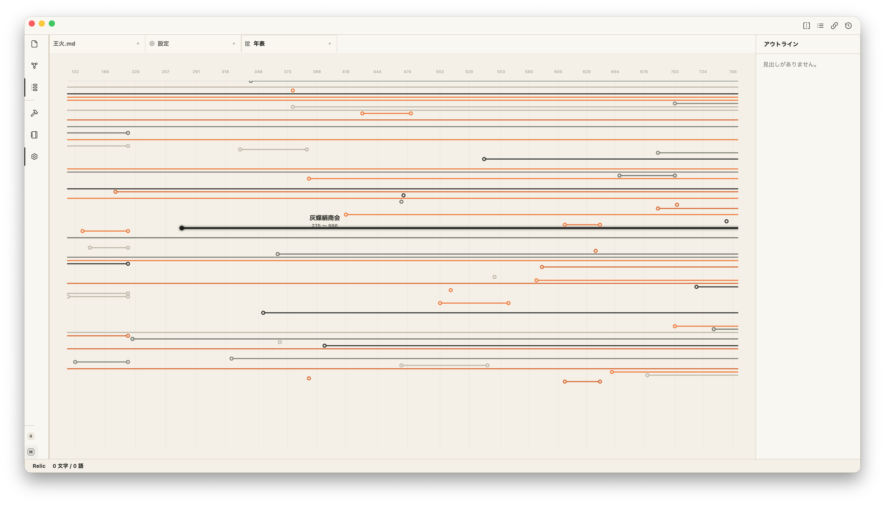

# Relic

[日本語はこちら](#日本語)

Relic is a local app for keeping information as plain Markdown files while extending how that information can be edited, viewed, searched, visualized, and exported.

Relic treats Markdown text as the source of truth: body text, headings, lists, tables, links, tags, front matter, and code blocks remain readable and portable as Markdown. Mermaid and D2 diagrams are also handled as Markdown code blocks, not as Relic-only diagram data.

Relic is open source software licensed under the GNU Affero General Public License v3.0 or later (AGPL-3.0-or-later).

> Status: In development

---

## Who Relic Is For

- People who want to keep long-lived knowledge in Markdown files.
- People who want to use links, tags, front matter, and code blocks as the basis for search, reading, visualization, and export.
- People organizing worldbuilding notes, research notes, learning notes, personal wikis, or project documentation locally.
- People who want to manage local folders or cloud-synced folders without locking their notes into a proprietary database.

---

## Main Features

### Markdown Workspace

- Markdown editor with live preview.
- Local workspace management.
- File and folder creation, rename, move, duplicate, delete, and pinning.
- Tabs, split view, and a right-side panel.
- Light, dark, and system-following themes.



### Linking, Search, and Structure

- Internal links using `[[...]]`.
- Backlinks and outgoing links.
- Outline view.
- Quick switcher.
- Command palette.
- Full-text search, filename search, tag search, front matter search, regular expression search, and search-and-replace.

### Front Matter and Tags

- YAML front matter editing support.
- Front matter settings for fixed properties and custom property input.
- Tags from front matter `tags:`.

### Diagrams and Export

- Mermaid and D2 diagram rendering from Markdown code blocks.
- Print and PDF export from Markdown preview.
- Copy and save diagram SVG output.

### Timeline

- Timeline view for Markdown content.



### File Processing Tools

- Merge files.
- Generate title lists.
- Generate tables of contents.
- Generate tag indexes.

---

## Platforms

- macOS
- Windows

Relic is an Electron app. OS-specific handling is kept to the places where it is necessary, and normal file operations are treated as operations on each OS's local folders.

---

## Tech Stack

- TypeScript
- Electron
- React
- CodeMirror 6
- Zustand
- Vitest
- Electron Forge
- pnpm

See [docs/engineering/stack.md](docs/engineering/stack.md) for details.

---

## Repository Structure

- `app/`: Electron / React app.
- `docs/`: Planning, specifications, design, and development documents.
- `docs/project/`: Relic's purpose, target users, and terminology.
- `docs/features/`: Feature specifications.
- `docs/design/`: Screens, navigation, and design system documents.
- `docs/engineering/`: Architecture, data model, and technical decisions.
- `docs/development/`: Development phases, coding rules, and testing policy.
- `scripts/`: Helper scripts for running and building the app.
- `AGENTS.md`: Shared rules for AI agents working on this repository.
- `CONTRIBUTING.md`: Contribution guidelines.
- `LICENSE`: AGPL-3.0-or-later license text.
- `SECURITY.md`: Policy for secrets, credentials, and vulnerability reporting.
- `README.md`: Public project overview.

---

## Development

Run app commands from `app/`.

```sh
cd app
pnpm install
pnpm start
```

OS-specific start aliases:

```sh
pnpm start:mac
pnpm start:win
```

`start:mac` and `start:win` are aliases for the same Electron development start command. Use the alias that matches the OS you are running on.

If you prefer not to use terminal commands directly, helper scripts are available in `scripts/`.

- macOS: `scripts/Relicを起動.command`
- Windows: `scripts/Relicを起動.bat`

---

## Verification

Run type checking and tests together:

```sh
cd app
pnpm verify
```

Run verification plus whitespace checks for code and documentation diffs:

```sh
cd app
pnpm verify:full
```

Run checks individually:

```sh
pnpm typecheck
pnpm test
git -C .. diff --check
```

OS-specific test aliases:

```sh
pnpm test:mac
pnpm test:win
```

`verify:full` runs `pnpm verify` and then runs `git diff --check` from the repository root. The packaged app under `app/out/` is checked only when distribution build verification is explicitly requested.

---

## macOS Build

```sh
cd app
pnpm build:mac:safe
```

You can also run `scripts/Relicをビルド.command`, which executes `build:mac:safe`.

`build:mac:safe` runs:

1. `clean:out` to remove `app/out`.
2. `make:mac` to generate macOS build artifacts.
3. `check:mac:safe` to verify the build output.

Verification checks:

- Required: `out/Relic-darwin-*/Relic.app/Contents/MacOS/Relic`
- Required: `out/Relic-darwin-*/Relic.app/Contents/Resources/app.asar`
- Forbidden: `Setup*.exe` / `Update.exe` / `*.nupkg` / `RELEASES`

---

## Windows Build

The Windows build is distributed without an installer. After extracting the ZIP, run `Relic.exe` directly.

```sh
cd app
pnpm build:win:safe
```

You can also run `scripts/Relicをビルド.bat`, which executes `build:win:safe`.

`build:win:safe` runs:

1. `clean:out` to remove `app/out`.
2. `package:win` to generate an unpacked app.
3. `check:win:safe` to verify the build output.

Verification checks:

- Required: `out/Relic-win32-x64/Relic.exe`
- Required: `out/Relic-win32-x64/resources/app.asar`
- Forbidden: `Setup*.exe` / `Update.exe` / `*.nupkg` / `RELEASES`

For distribution, provide the `out/Relic-win32-x64/` folder as-is or zip it.

---

## Documentation

- Document index and classification: [docs/INDEX.md](docs/INDEX.md)
- Current development phase: [docs/development/phases.md](docs/development/phases.md)
- Project overview: [docs/project/overview.md](docs/project/overview.md)
- Glossary: [docs/project/terms.md](docs/project/terms.md)
- Feature specifications: [docs/features](docs/features)
- Design documents: [docs/design](docs/design)
- Engineering documents: [docs/engineering](docs/engineering)
- Tech stack: [docs/engineering/stack.md](docs/engineering/stack.md)
- Coding rules, testing policy, and versioning: [docs/development/coding-rules.md](docs/development/coding-rules.md), [docs/development/testing-rules.md](docs/development/testing-rules.md), [docs/development/versioning-rules.md](docs/development/versioning-rules.md)

Historical phase documents and older logs have been consolidated into `docs/development/phases/P0.md`. Current specifications and design decisions are documented in the canonical documents above.

---

## Contributing

Contributions to Relic are welcome. Before opening a pull request, please read [CONTRIBUTING.md](CONTRIBUTING.md).

Unless otherwise agreed, submitted code and documentation are treated as AGPL-3.0-or-later, the same license as Relic itself.

---

## License

Relic is licensed under the GNU Affero General Public License v3.0 or later (AGPL-3.0-or-later). See [LICENSE](LICENSE) for the full license text.

Relic uses AGPL-3.0-or-later to allow forks and commercial use while keeping corresponding source code available to users of modified versions, including versions provided over a network.

---

## 日本語

Relicは、Markdownに書ける情報をMarkdownファイルのまま保ち、その情報をもとに編集・閲覧・検索・可視化・出力を拡張するローカルアプリです。

本文、見出し、リスト、表、リンク、タグ、フロントマター、コードブロックなど、Markdown内にテキストとして書ける情報を正本として扱います。MermaidやD2の図表も、Relic独自の図データではなく、Markdownコードブロックとして書ける情報だから扱います。

Relicはオープンソースソフトウェアです。ライセンスは GNU Affero General Public License v3.0 or later（AGPL-3.0-or-later）です。

> ステータス: 開発中

---

## 対象ユーザー

- Markdownに書いた情報を、Markdownファイルのまま長く残したい人
- Markdown内のリンク、タグ、フロントマター、コードブロックなどをもとに、検索・閲覧・可視化・出力を広げたい人
- 創作設定、研究ノート、学習メモ、個人Wiki、プロジェクト資料などをローカルに整理したい人
- ローカルフォルダやクラウド同期フォルダを、自分で管理できる形のまま使いたい人

---

## 現在の主な機能

### Markdownワークスペース

- Markdownエディタ（ライブプレビュー）
- ローカルワークスペース管理
- ファイル / フォルダの作成、リネーム、移動、複製、削除、ピン留め
- タブ、左右分割表示、右パネル
- ライト / ダーク / システム追従テーマ


### リンク・検索・構造表示

- 内部リンク `[[...]]`
- バックリンク / アウトゴーイングリンク
- アウトライン表示
- クイックスイッチャー
- コマンドパレット
- 全文検索、ファイル名検索、タグ検索、フロントマター検索、正規表現検索、検索置換

### フロントマターとタグ

- フロントマター（YAML）編集補助
- フロントマター設定（固定プロパティ確認・カスタムプロパティ入力能力）
- フロントマター `tags:` によるタグ扱い

### 図表と出力

- MarkdownコードブロックのMermaid / D2図表表示
- Markdownプレビューの印刷 / PDF保存
- 図表SVGのコピー / 保存

### 年表

- Markdown内容の年表表示


### ファイル加工ツール

- ファイルのマージ
- タイトル一覧の生成
- 目次生成
- タグ別索引生成

---

## プラットフォーム

- macOS
- Windows

RelicはElectronアプリです。OS固有処理は必要な箇所だけに限定し、通常のファイル操作は各OSのローカルフォルダとして扱います。

---

## 技術スタック

- TypeScript
- Electron
- React
- CodeMirror 6
- Zustand
- Vitest
- Electron Forge
- pnpm

詳細は [docs/engineering/stack.md](docs/engineering/stack.md) を参照してください。

---

## リポジトリ構成

- `app/`: Electron / React アプリ本体
- `docs/`: 計画・仕様・設計・開発メモ
- `docs/project/`: Relicの目的、対象ユーザー、用語
- `docs/features/`: 機能仕様
- `docs/design/`: 画面構成、遷移、デザインシステム
- `docs/engineering/`: アーキテクチャ、データモデル、技術選定
- `docs/development/`: フェーズ、開発規約、検証方針
- `scripts/`: 起動・ビルドなどの補助スクリプト
- `AGENTS.md`: AIエージェント向けの共通ルール
- `CONTRIBUTING.md`: コントリビューション方針
- `LICENSE`: AGPL-3.0-or-laterのライセンス本文
- `SECURITY.md`: 秘密情報と認証情報の扱いに関する方針
- `README.md`: 対外的なプロジェクト説明

---

## 開発

アプリ本体のコマンドは `app/` で実行します。

```sh
cd app
pnpm install
pnpm start
```

OS別の起動エイリアス:

```sh
pnpm start:mac
pnpm start:win
```

`start:mac` / `start:win` は同じElectron開発起動をOS別名で呼ぶためのエイリアスです。実行するOS上で使います。

ターミナル操作を避けたい場合は、`scripts/` 配下の補助スクリプトで開発版を起動できます。

- macOS: `scripts/Relicを起動.command`
- Windows: `scripts/Relicを起動.bat`

---

## 検証

型チェックとテストをまとめて実行します。

```sh
cd app
pnpm verify
```

コードや文書の差分確認までまとめて行う場合:

```sh
cd app
pnpm verify:full
```

個別に実行する場合:

```sh
pnpm typecheck
pnpm test
git -C .. diff --check
```

OS別のテストエイリアス:

```sh
pnpm test:mac
pnpm test:win
```

`verify:full` は `pnpm verify` の後に、リポジトリルートの `git diff --check` を実行します。`app/out/` 配下のパッケージ版アプリは、配布ビルド確認を明示した場合だけ確認対象にします。

---

## Macビルド

```sh
cd app
pnpm build:mac:safe
```

補助スクリプトを使う場合は `scripts/Relicをビルド.command` を実行します。このスクリプトも `build:mac:safe` を実行します。

`build:mac:safe` は以下を順に実行します。

1. `clean:out` で `app/out` を削除
2. `make:mac` でmacOS向け成果物を生成
3. `check:mac:safe` で成果物を検証

検証内容:

- 必須: `out/Relic-darwin-*/Relic.app/Contents/MacOS/Relic`
- 必須: `out/Relic-darwin-*/Relic.app/Contents/Resources/app.asar`
- 禁止: `Setup*.exe` / `Update.exe` / `*.nupkg` / `RELEASES`

---

## Windowsビルド

Windows版はインストーラーを使わず、ZIP展開後に `Relic.exe` を直接起動する運用です。

```sh
cd app
pnpm build:win:safe
```

補助スクリプトを使う場合は `scripts/Relicをビルド.bat` を実行します。このスクリプトも `build:win:safe` を実行します。

`build:win:safe` は以下を順に実行します。

1. `clean:out` で `app/out` を削除
2. `package:win` で unpacked app を生成
3. `check:win:safe` で成果物を検証

検証内容:

- 必須: `out/Relic-win32-x64/Relic.exe`
- 必須: `out/Relic-win32-x64/resources/app.asar`
- 禁止: `Setup*.exe` / `Update.exe` / `*.nupkg` / `RELEASES`

配布する場合は、`out/Relic-win32-x64/` フォルダをそのまま配布するかZIP化します。

---

## ドキュメント

- 文書索引・分類: [docs/INDEX.md](docs/INDEX.md)
- 現在の開発フェーズ: [docs/development/phases.md](docs/development/phases.md)
- プロジェクト概要: [docs/project/overview.md](docs/project/overview.md)
- 用語集: [docs/project/terms.md](docs/project/terms.md)
- 機能仕様: [docs/features](docs/features)
- デザイン文書: [docs/design](docs/design)
- エンジニアリング文書: [docs/engineering](docs/engineering)
- 技術スタック: [docs/engineering/stack.md](docs/engineering/stack.md)
- 開発規約・テスト方針・バージョン管理: [docs/development/coding-rules.md](docs/development/coding-rules.md), [docs/development/testing-rules.md](docs/development/testing-rules.md), [docs/development/versioning-rules.md](docs/development/versioning-rules.md)

旧フェーズ文書と旧日誌の履歴は `docs/development/phases/P0.md` に統合済みです。現行の仕様・設計判断は上記の正本文書を参照します。

---

## コントリビューション

Relicへのコントリビューションを歓迎します。Pull Requestを送る前に [CONTRIBUTING.md](CONTRIBUTING.md) を確認してください。

提出されたコードやドキュメントは、特別な合意がない限り、Relic本体と同じAGPL-3.0-or-laterとして取り扱います。

---

## ライセンス

Relicは GNU Affero General Public License v3.0 or later（AGPL-3.0-or-later）で公開されています。全文は [LICENSE](LICENSE) を参照してください。

AGPL-3.0-or-laterを採用する理由は、フォークや商用利用を許可しながら、改変版やネットワーク経由で提供される派生版についても、利用者が対応するソースコードへアクセスできる状態を保つためです。
