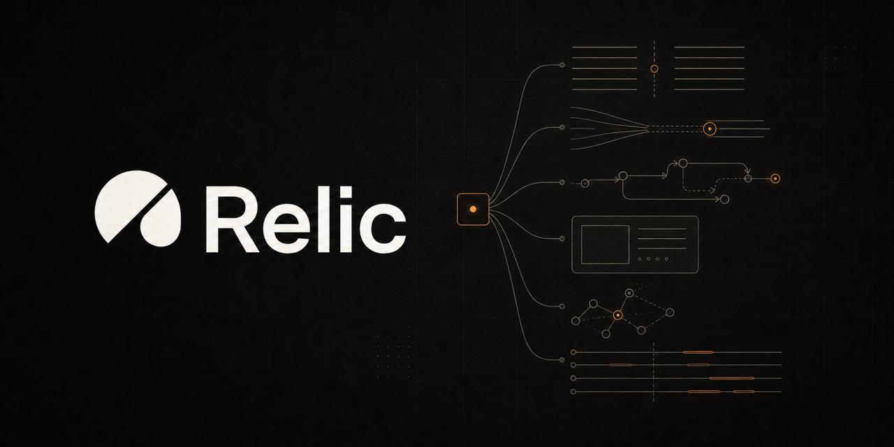
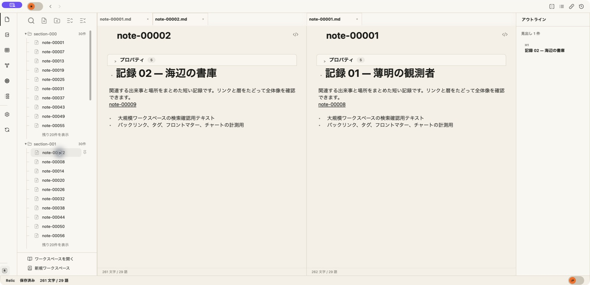
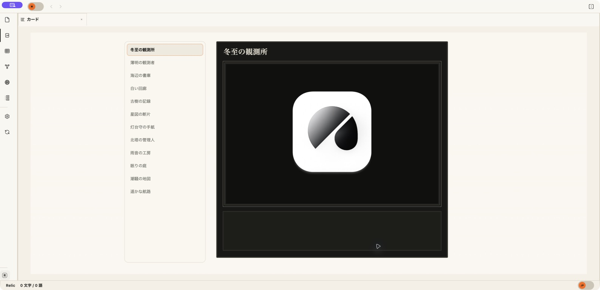
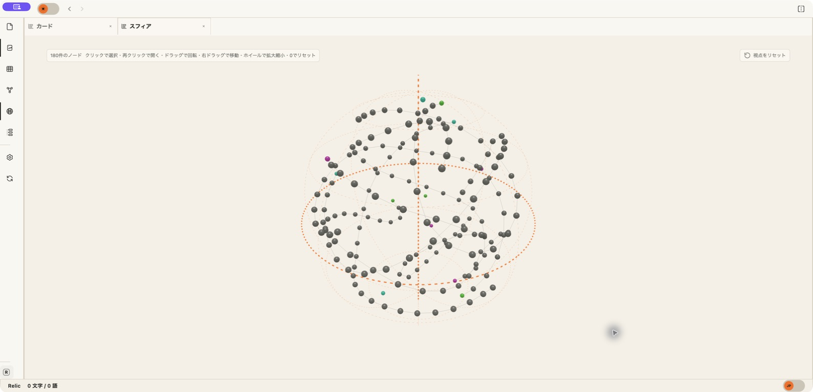
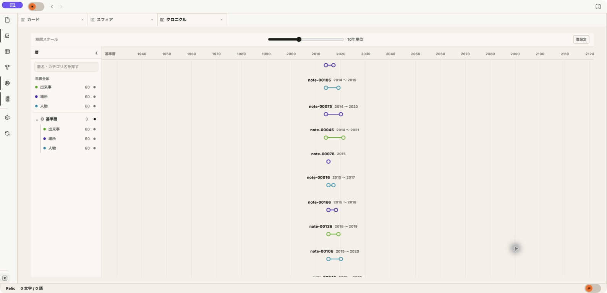

# Relic

[日本語はこちら](#日本語)



Relic is a local app for keeping information as plain Markdown files while extending how that information can be edited, viewed, searched, visualized, and exported.

Relic treats Markdown text as the source of truth: body text, headings, lists, tables, links, tags, front matter, and code blocks remain readable and portable as Markdown. Mermaid and D2 diagrams are also handled as Markdown code blocks, not as Relic-only diagram data.

Relic is an owner-led open source project licensed under the GNU Affero General Public License v3.0 or later (AGPL-3.0-or-later). Development and project decisions are expected to be handled primarily by the project owner; external issues and pull requests are not actively solicited.

> Status: In development

---

## Who Relic Is For

- People who want to keep long-lived knowledge in Markdown files.
- People who want to use links, tags, front matter, and code blocks as the basis for search, reading, visualization, and export.
- People organizing worldbuilding notes, research notes, learning notes, personal wikis, or project documentation locally.
- People who want to manage local folders or cloud-synced folders without locking their notes into a proprietary database.

---

## Main Features

### Markdown Workspace

- File view for reading and editing Markdown.
- Markdown editor with live preview, source mode, and optional typewriter mode.
- Live editing for Markdown tables and task checkboxes.
- Footnotes, syntax-highlighted code blocks, and inline or block math.
- Page previews for internal links and collapsible Markdown headings.
- Automatic saving with recovery versions for restoring earlier content.
- Local workspace management.
- File and folder creation, rename, move, duplicate, delete, and pinning.
- Tabs, split view, and a right-side panel.
- Light, dark, and system-following themes.



### Attachments and Embedded Content

- Drag supported images into Markdown to copy them into the workspace and insert standard Markdown image syntax.
- Open workspace images and PDF attachments in dedicated viewing tabs.
- Embed another workspace Markdown file with `![[file]]` while keeping the source file as Markdown.

### Card View

- Card view presents Markdown files with a `card` front matter property as visual cards.
- Selecting an item in the list previews its card. Selecting the same list item again opens the source Markdown file; the large card itself remains read-only.



### Table View

- Table view lists every Markdown file and selected top-level front matter properties.
- Search, filter, sort, reorder, resize, and wrap columns without changing the Markdown source.
- Open a source file from its row, and manage fixed-property guidance and `category` choices from property columns.

### Linking, Search, and Structure

- Internal links using `[[...]]` and relative Markdown links.
- Backlinks, outgoing links, and unlinked references.
- Bubble view for relationships between existing Markdown files.
- Sphere view for exploring the same workspace graph in 3D.
- Outline view.
- Quick switcher.
- Command palette.
- Quick switching by file name, path, or alias, plus search and filtering within supported views.



### Front Matter and Tags

- Collapsible form editing for existing YAML front matter values, with source-mode access to the original YAML.
- Guided addition and editing for fixed properties (`aliases`, `card`, `category`, `tags`, `chronicle`).
- Read-only overview of any top-level property in Table view.
- Tags from front matter `tags:`.

### Diagrams and Export

- Mermaid and D2 diagram rendering from Markdown code blocks.
- PDF export from Markdown preview.
- Copy and save diagram SVG output.

### Chronicle View

- Chronicle view that places Markdown files on a timeline from `chronicle` front matter values.



### File Processing Tools

- Create new Markdown files by merging files or generating title lists, tables of contents, and tag indexes.
- Run file processing from the context menu for a workspace, folder, or multi-file selection; existing source files are not changed.

---

## Platforms

- macOS on Apple Silicon

Relic is a macOS-only Electron app. Electron keeps the TypeScript, React, CodeMirror, visualization, and local-file boundaries in one desktop architecture; it is not used to provide other operating-system builds.

---

## Tech Stack

- TypeScript
- Electron
- React
- CodeMirror 6
- Zustand
- Vitest
- Electron Forge
- pnpm

See [docs/engineering/stack.md](docs/engineering/stack.md) for details.

---

## Repository Structure

- `app/`: Electron / React app.
- `docs/`: Specifications, design, and development documents.
- `docs/project/`: Relic's purpose, target users, and terminology.
- `docs/features/`: Feature specifications.
- `docs/design/`: Screens, navigation, and design system documents.
- `docs/engineering/`: Architecture, data model, and technical decisions.
- `docs/development.md`: Development rules, coding rules, testing policy, versioning, and release operations.
- `skills/`: Distributable Codex Skills for people using Relic. These are separate from repository-development agent instructions.
- `scripts/`: Helper scripts for running and building the app.
- `AGENTS.md`: Shared rules for AI agents working on this repository.
- `CONTRIBUTING.md`: Contribution guidelines.
- `LICENSE`: AGPL-3.0-or-later license text.
- `SECURITY.md`: Policy for secrets, credentials, and vulnerability reporting.
- `README.md`: Public project overview.

---

## Development

Run app commands from `app/`. The supported development Node.js range is defined by `app/package.json` `engines.node`. pnpm is pinned by `packageManager` and enabled through Corepack.

```sh
cd app
corepack enable
pnpm install
pnpm start
```

macOS start alias:

```sh
pnpm start:mac
```

`start:mac` is an alias for the Electron development start command.

If you prefer not to use terminal commands directly, helper scripts are available in `scripts/`.

- `scripts/Relicを起動.command`

---

## Verification

Run the runtime check, type checking, tests, and dependency-license file checks together:

```sh
cd app
pnpm verify
```

Run the full set of locally reproducible checks, including coverage reporting, architecture, documentation, workflow, Skill structure, and dependency-license file checks:

```sh
cd app
pnpm verify:full
```

Run the reproducible part of Code CI, adding the Renderer production build and import-boundary checks plus a production dependency audit:

```sh
pnpm verify:ci
```

Run checks individually:

```sh
pnpm typecheck
pnpm test
pnpm docs:index:check
git -C .. diff --check
```

Print the current Git-tracked file tree without changing documentation:

```sh
pnpm docs:tree
```

macOS test alias:

```sh
pnpm test:mac
```

Pull Requests, pushes to `main`, and manual Code CI runs execute `verify:ci` and an isolated development-app startup smoke check on macOS. Pull Requests additionally validate version policy against their base and head commits. The packaged app under `app/out/` is checked only when distribution build verification is explicitly requested. Before creating a release tag, the manual Pre-release Verification workflow can run the macOS safe build and a packaged-app startup smoke check without creating a tag, Release, push, or repository change.

---

## macOS Build

```sh
cd app
pnpm build:mac:safe
```

You can also run `scripts/Relicをビルド.command`, which executes `build:mac:safe`.

`build:mac:safe` runs:

1. Verifies that the host is an Apple Silicon Mac.
2. Removes the previous `app/out/darwin` output.
3. Runs Electron Forge `make` for macOS arm64.
4. Verifies the generated package and its contents.

Verification checks:

- Required: `out/darwin/Relic-darwin-arm64/Relic.app/Contents/MacOS/Relic`
- Required: `out/darwin/Relic-darwin-arm64/Relic.app/Contents/Resources/app.asar`

---

## Documentation

- Documentation index and task-based routing: [docs/INDEX.md](docs/INDEX.md)
- Project overview: [docs/project/overview.md](docs/project/overview.md)
- Glossary: [docs/project/terms.md](docs/project/terms.md)
- Feature specifications: [docs/features](docs/features)
- Design documents: [docs/design](docs/design)
- Engineering documents: [docs/engineering](docs/engineering)
- Tech stack: [docs/engineering/stack.md](docs/engineering/stack.md)
- Development rules, coding rules, testing policy, versioning, and release operations: [docs/development.md](docs/development.md)

Current specifications and design decisions are documented in the documents above.

---

## Local Data and Privacy

Relic treats Markdown files in the local folder selected by the user as the source of truth.
Markdown content remains in that folder without being converted into a Relic-specific format.

Application settings are stored in the operating system's per-application data location.
Registered workspace names, absolute local paths, and interface settings are stored so Relic can restore workspaces.

Relic currently performs no automatic updates, external synchronization, external log transmission, or cloud storage.
Development commands that send information to external services, such as dependency audits, are used only when explicitly run under the development rules.

---

## Development and Contributions

Relic is developed and maintained primarily by the project owner. Public source code does not imply shared control of the roadmap or an invitation to participate in development.

External issues, feature requests, and pull requests are not actively solicited. Submitting one is not prohibited, but no response, investigation, review, acceptance, merge, implementation, or schedule is promised. The owner may close a submission without taking action.

If you still choose to submit an issue or pull request, read [CONTRIBUTING.md](CONTRIBUTING.md) first.

Unless otherwise agreed, submitted code and documentation are treated as AGPL-3.0-or-later, the same license as Relic itself.

This development policy does not limit the rights to use, modify, or redistribute Relic under AGPL-3.0-or-later.

---

## License

Relic is licensed under the GNU Affero General Public License v3.0 or later (AGPL-3.0-or-later). See [LICENSE](LICENSE) for the full license text.

Relic uses AGPL-3.0-or-later to allow forks and commercial use while keeping corresponding source code available to users of modified versions, including versions provided over a network.

---

## 日本語


Relicは、Markdownに書ける情報をMarkdownファイルのまま保ち、その情報をもとに編集・閲覧・検索・可視化・出力を拡張するローカルアプリです。

本文、見出し、リスト、表、リンク、タグ、フロントマター、コードブロックなど、Markdown内にテキストとして書ける情報を正本として扱います。MermaidやD2の図表も、Relic独自の図データではなく、Markdownコードブロックとして書ける情報だから扱います。

Relicは、GNU Affero General Public License v3.0 or later（AGPL-3.0-or-later）で公開する、オーナー主導のオープンソースプロジェクトです。開発とプロジェクト上の意思決定は基本的にプロジェクトオーナー本人が行い、外部からのIssueやPull Requestは積極的に募集しません。

> ステータス: 開発中

---

## 対象ユーザー

- Markdownに書いた情報を、Markdownファイルのまま長く残したい人
- Markdown内のリンク、タグ、フロントマター、コードブロックなどをもとに、検索・閲覧・可視化・出力を広げたい人
- 創作設定、研究ノート、学習メモ、個人Wiki、プロジェクト資料などをローカルに整理したい人
- ローカルフォルダやクラウド同期フォルダを、自分で管理できる形のまま使いたい人

---

## 現在の主な機能

### Markdownワークスペース

- Markdownを表示・編集するファイルビュー
- ライブプレビュー、ソースモード、任意のタイプライターモードを備えたMarkdownエディタ
- Markdownテーブルとタスクチェックボックスのライブ編集
- 脚注、シンタックスハイライト付きコードブロック、インライン数式・ブロック数式
- 内部リンクのページプレビューとMarkdown見出しの折りたたみ
- 以前の本文を読み戻せる復元版を伴う自動保存
- ローカルワークスペース管理
- ファイル / フォルダの作成、リネーム、移動、複製、削除、ピン留め
- タブ、左右分割表示、右パネル
- ライト / ダーク / システム追従テーマ


### 添付ファイルと埋め込み

- 対応画像をMarkdownへドラッグし、ワークスペースへのコピーと標準Markdown画像記法の挿入ができます
- ワークスペース内の画像とPDF添付ファイルを専用の閲覧タブで表示できます
- 元ファイルをMarkdownのまま保ち、`![[ファイル名]]` で別のMarkdownファイルを埋め込めます

### カードビュー

- フロントマターに `card` プロパティを持つMarkdownファイルを、カードビューに表示します
- 一覧項目を選ぶとカードを切り替え、選択中の同じ項目をもう一度選ぶと元のMarkdownファイルを開きます。大きなカード自体は表示専用です


### テーブルビュー

- すべてのMarkdownファイルと、選択したトップレベルのフロントマタープロパティを表で確認できます
- Markdown本文を変更せず、検索、絞り込み、並び替え、列の移動・幅変更・折り返しができます
- 行から元ファイルを開き、プロパティ列から固定プロパティの説明や `category` 候補を管理できます

### リンク・検索・構造表示

- 内部リンク `[[...]]` とMarkdown相対リンク
- バックリンク、アウトゴーイングリンク、未リンク参照
- 実在するMarkdownファイル同士の関係を表示するバブルビュー
- 同じワークスペースグラフを3次元で見渡すスフィアビュー
- アウトライン表示
- クイックスイッチャー
- コマンドパレット
- ファイル名・パス・別名によるクイック切り替えと、対応ビュー内の検索・絞り込み


### フロントマターとタグ

- 既存のフロントマター値を折りたたみ式フォームで編集でき、ソースモードでは元のYAMLを直接確認・編集できます
- 固定プロパティ（`aliases`、`card`、`category`、`tags`、`chronicle`）の追加・編集をフォームで補助します
- テーブルビューでは、任意のトップレベルプロパティを読み取り専用の一覧として確認できます
- フロントマター `tags:` によるタグ扱い

### 図表と出力

- MarkdownコードブロックのMermaid / D2図表表示
- MarkdownプレビューのPDF保存
- 図表SVGのコピー / 保存

### クロニクルビュー

- `chronicle` フロントマター値からMarkdownファイルを時間軸上の年表へ配置するクロニクルビュー


### ファイル加工ツール

- ファイルのマージ、タイトル一覧、目次、タグ別索引を、新しいMarkdownファイルとして生成します
- ワークスペース、フォルダ、複数ファイル選択の右クリックメニューから実行し、既存の元ファイルは変更しません

---

## プラットフォーム

- Apple Silicon搭載MacのmacOS

RelicはmacOS専用のElectronアプリです。ElectronはTypeScript、React、CodeMirror、可視化、ローカルファイル操作の境界を一つのデスクトップ構成で維持するために使い、他OS向けビルドは提供しません。

---

## 技術スタック

- TypeScript
- Electron
- React
- CodeMirror 6
- Zustand
- Vitest
- Electron Forge
- pnpm

詳細は [docs/engineering/stack.md](docs/engineering/stack.md) を参照してください。

---

## リポジトリ構成

- `app/`: Electron / React アプリ本体
- `docs/`: 仕様・設計・開発文書
- `docs/project/`: Relicの目的、対象ユーザー、用語
- `docs/features/`: 機能仕様
- `docs/design/`: 画面構成、遷移、デザインシステム
- `docs/engineering/`: アーキテクチャ、データモデル、技術選定
- `docs/development.md`: 開発ルール、コーディング規約、テスト方針、バージョン管理、リリース運用
- `skills/`: Relic利用者へ配布するCodex Skill。リポジトリ開発エージェント向けの指示とは分離する
- `scripts/`: 起動・ビルドなどの補助スクリプト
- `AGENTS.md`: AIエージェント向けの共通ルール
- `CONTRIBUTING.md`: コントリビューション方針
- `LICENSE`: AGPL-3.0-or-laterのライセンス本文
- `SECURITY.md`: 秘密情報と認証情報の扱いに関する方針
- `README.md`: 対外的なプロジェクト説明

---

## 開発

アプリ本体のコマンドは `app/` で実行します。開発用Node.jsの対応範囲は `app/package.json` の `engines.node`、pnpmの版は `packageManager` を正本とし、Corepackで有効化します。

```sh
cd app
corepack enable
pnpm install
pnpm start
```

macOS向けの起動エイリアス:

```sh
pnpm start:mac
```

`start:mac` はElectron開発起動のエイリアスです。

ターミナル操作を避けたい場合は、`scripts/` 配下の補助スクリプトで開発版を起動できます。

- `scripts/Relicを起動.command`

---

## 検証

Node.js環境、型、テスト、依存ライセンス文書の整合をまとめて確認します。

```sh
cd app
pnpm verify
```

カバレッジ測定、アーキテクチャ、文書、workflow、Skill構造、依存ライセンス文書まで、ローカルで再現可能な包括確認を行う場合:

```sh
cd app
pnpm verify:full
```

Rendererのproduction buildと初期読込境界、production依存関係の脆弱性監査も加え、Code CIの再現可能部分を実行する場合:

```sh
pnpm verify:ci
```

個別に実行する場合:

```sh
pnpm typecheck
pnpm test
pnpm docs:index:check
git -C .. diff --check
```

文書を変更せず、Gitで管理している現在のファイルツリーを表示する場合:

```sh
pnpm docs:tree
```

macOS向けのテストエイリアス:

```sh
pnpm test:mac
```

Pull Request、`main`へのpush、手動のCode CIは、macOSで `verify:ci` と隔離した開発版の自動起動スモークを実行します。Pull Requestではbase/head間のバージョン規則も追加確認します。`app/out/` 配下のパッケージ版アプリは、配布ビルド確認を明示した場合だけ確認対象にします。Releaseタグ作成前は手動のPre-release Verification workflowで、タグ、Release、push、リポジトリ変更を行わずにmacOSのsafe buildと配布版の自動起動スモークを実行できます。

---

## macOSビルド

```sh
cd app
pnpm build:mac:safe
```

補助スクリプトを使う場合は `scripts/Relicをビルド.command` を実行します。このスクリプトも `build:mac:safe` を実行します。

`build:mac:safe` は以下を順に実行します。

1. 実行環境がApple Silicon搭載Macであることを確認
2. 前回の `app/out/darwin` を削除
3. Electron Forgeの `make` をmacOS arm64向けに実行
4. 生成したパッケージと内容を検証

検証内容:

- 必須: `out/darwin/Relic-darwin-arm64/Relic.app/Contents/MacOS/Relic`
- 必須: `out/darwin/Relic-darwin-arm64/Relic.app/Contents/Resources/app.asar`

---

## ドキュメント

- 文書索引・作業別の参照先: [docs/INDEX.md](docs/INDEX.md)
- プロジェクト概要: [docs/project/overview.md](docs/project/overview.md)
- 用語集: [docs/project/terms.md](docs/project/terms.md)
- 機能仕様: [docs/features](docs/features)
- デザイン文書: [docs/design](docs/design)
- エンジニアリング文書: [docs/engineering](docs/engineering)
- 技術スタック: [docs/engineering/stack.md](docs/engineering/stack.md)
- 開発ルール・コーディング規約・テスト方針・バージョン管理・リリース運用: [docs/development.md](docs/development.md)

現行の仕様・設計判断は上記の文書を参照します。

---

## ローカルデータとプライバシー

Relicは、ユーザーが選んだローカルフォルダ内のMarkdownファイルを正本として扱います。
Markdown本文はRelic専用の形式へ変換せず、ユーザーが選んだフォルダに残ります。

アプリ設定は、OSがアプリごとに用意する設定保存場所に保存します。
登録したワークスペースの名前、ローカル絶対パス、画面設定などは、ワークスペースを復元するために保存します。

現時点では、自動更新、外部同期、外部ログ送信、クラウド保存は行いません。
依存関係監査など、外部サービスへ情報を送る開発用コマンドは、開発ルールに従って明示的に実行する場合だけ使います。

---

## 開発体制と外部投稿

Relicの開発と保守は、基本的にプロジェクトオーナー本人が行います。ソースコードを公開していることは、ロードマップを共同で決定することや、開発への参加を求めることを意味しません。

外部からのIssue、機能要望、Pull Requestは積極的に募集していません。投稿は禁止しませんが、返信、調査、レビュー、採用、マージ、実装、対応時期のいずれも約束しません。オーナー判断で、対応せずに投稿をcloseする場合があります。

それでもIssueやPull Requestを送る場合は、先に [CONTRIBUTING.md](CONTRIBUTING.md) を確認してください。

提出されたコードやドキュメントは、特別な合意がない限り、Relic本体と同じAGPL-3.0-or-laterとして取り扱います。

この開発方針は、AGPL-3.0-or-laterに基づくRelicの利用、改変、再配布の権利を制限しません。

---

## ライセンス

Relicは GNU Affero General Public License v3.0 or later（AGPL-3.0-or-later）で公開されています。全文は [LICENSE](LICENSE) を参照してください。

AGPL-3.0-or-laterを採用する理由は、フォークや商用利用を許可しながら、改変版やネットワーク経由で提供される派生版についても、利用者が対応するソースコードへアクセスできる状態を保つためです。
