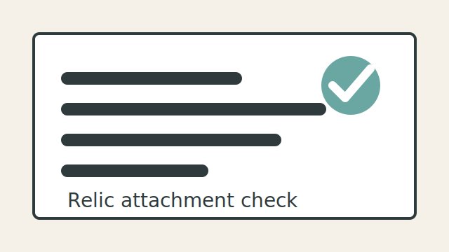

# 添付確認

Markdownから添付ファイルへ相対リンクできるか確認します。

## 画像

## テキスト添付

- [添付メモ](docs/attachment-note.txt)
- [CSVサンプル](data/sample-table.csv)

## 確認観点

- 相対リンクをクリックできるか
- 画像プレビューが表示されるか
- 添付ファイル名が検索・ファイル一覧で扱えるか
